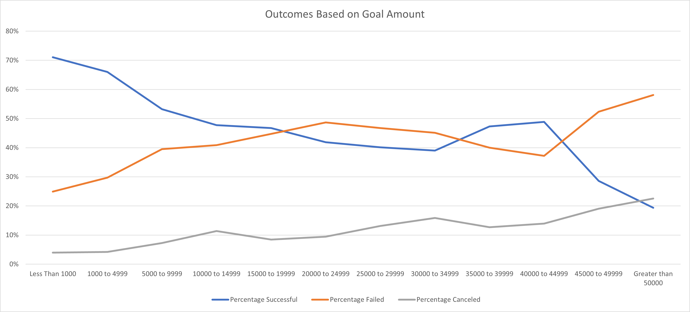

# Kickstart my [Chart]
### Background
Over two billion dollars have been raised using the massively successful crowdfunding service, Kickstarter, but not every project has found success. Out of over 300,000 projects launched on Kickstarter, only a third have made it through the funding process with a positive outcome.

Since getting funded on Kickstarter requires meeting or exceeding the project's initial goal, many organizations spend months looking through past projects in an attempt to discover some trick to finding success. 

For this project, I was tasked with organizing and analyzing a database of four thousand past projects in order to uncover any hidden trends.

### Conclusions about Kickstarter campaigns

* If somebody wants to fund a project on Kickstarter, they may want to launch it during May. Over 60% of projects launched during this time are successful.

* Based on category breakdown, music projects have been the most likely to be successful. Over 77% of music projects were successfully funded on Kickstarter.

* Based on sub-category breakdown, plays are the most uncertain. Plays hold the honor of having the most successfully funded projects, and the honor of having the most failed funding endeavors.

* Based on funding goals, projects with a budget of $5000 or less are the most likely to be successful.

### Limitations of this dataset

While the data shows how many projects were canceled, there are no listed reasons for their cancellation. One project in particular was 95% of the way to meeting its goal before it was cancelled – might be worth looking into why the fundraising efforts were called to a halt. 
Furthermore, while the data shows how many projects were successfully funded, it does not list how often those efforts led to successfully created projects. There have been horror stories of Kickstarter campaigns leaving their backers with nothing but a loss of funds.
  
  
### Other Possible Tables/Graphs

A pie chart broken down by parent category or sub-category can show what proportion of projects are successfully funded within a given field. Likewise, a pie chart broken down by the months they were funded, or all the campaigns created within their given years, can give us a picture of what projects were successful by monthly breakdowns, or how many projects were successful in this decade compared to last decade.
